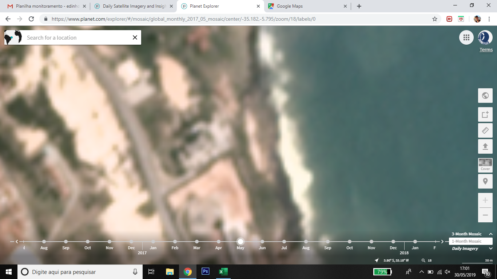

HIMB Summer Course - Remote Sensing Independent Project
================
Edson A. Vieira
2019-05-31

## Measuring a sand patch using multiple image tools

## Summary

Measurement (area and color intensity) of a sand patch adjacent to a
tide pool which we’ve been monitoring coral health for the last 2 years.
This measurement will be a proxy of potential of burial for those corals
and will be correlated to the percentage of coral bleached area.

## Question(s)

Insert here the specific, testable question(s) your project seeks to
answer.

  - Question 1: Are the measurements (area and color intensity) obtained
    from satellite imagery of an adjacent sand patch correlated to the
    visual estimate registered in the tide pool in situ?
  - Question 2: Is there a correlation between the measurements of sand
    in the adjacent area obtained by satellite imagery and the
    percentage of coral bleached area in the tide pool?

## Introduction

Global changes are the main threat to corals in a global scale.
Commonly, the increase of temperature leads to bleaching, however other
stressing factors may also result in such outcome. We’ve noticed in a
tide pool that has been monitored for 2 years now that the percentage of
coral bleaching is not necessarily correlated to the increase in
temperature, but rather may be guided by the increase of the amount of
sand inside the tide pool, which consequently may cover the corals.

## Methods

  - Measurement of the sand patch area on Planet.com every month from
    May 2017 to April 2019
  - Collection of monthly screenshots on Planet.com centered in the sand
    patch adjacent to the tide pool (maximum zoom in - sacle bar=50m)
  - Editing of each screenshot drawing a line that determine the area to
    be measured - equal area and shape for all screenshots
  - Determination of the white scale measuring the color intensity of an
    area defined over the white part of the wave in front of the sand
    patch - performed in Image J
  - Measurement of the color intensity of the whole area of the patch
    sand determined before
  - Correlations between:
      - area and color intensity
      - area and field percentage of burial
      - color intensity and field percentage of burial
      - area and field percentage of bleached area
      - color intensity and field percentage of bleached area

  

## Results

All the areas were already measured and the screenshots collected and
edited. The measurements of white scale were all performed and the color
intensity of the sand patch area is being conducted

## Discussion

  - Using satellite imagery may be very useful to obtain data for sand
    coming in and out from the tide pool during the year
  - Merging satellite imagery collection (Planet.com), image editing
    (Photoshop) and image analysis (Image J) is quite useful and fun
  - Difficulties: selection of the area to be measured in Image J -
    takes a bit long to do that

## References

You won’t likely need this section at this stage, but when you’re
writing a paper, can insert references into RMardown docs - see
<https://rmarkdown.rstudio.com/authoring_bibliographies_and_citations.html>.
